# Architecture

Bilibili Subtitle Vocabulary is a Manifest V3 browser extension. The following diagram shows the high-level modules and how they exchange data.

```mermaid
graph TB
    subgraph BrowserExtension["Browser Extension"]
        subgraph ContentScript["Content Scripts (injected into Bilibili / YouTube)"]
            CS_INDEX["contentScript/index.js"]
            CS_PIPELINE["contentScript/translation-pipeline.js"]
            CS_OBSERVER["contentScript/dom-observer.js"]
            CS_DANMAKU["contentScript/danmaku-engine.js"]
            CS_NAV["contentScript/subtitle-navigation-bridge.js"]
            SP["subtitleParser.js"]
            TR["translator.js"]
            REN["renderer.js"]
            TT["tooltip.js"]
            WEB["webTextReplacement.js"]
        end

        subgraph Background["Background Service Worker"]
            BG["background.js"]
            BG_CMD["background-commands.js"]
            BG_MSG["background-message-handler.js"]
            BG_SET["background-settings.js"]
            BG_STG["background-storage.js"]
        end

        subgraph ReactUI["React UI Surfaces"]
            POPUP["popup-main.tsx"]
            OPTIONS["options-main.tsx"]
            OVERLAY["overlay-entry.tsx"]
        end

        subgraph Storage["Storage Layer"]
            CHROME_STG[("chrome.storage.local")]
            SS["sharedSettings.js"]
            UI_STG["react-ui/src/lib/*-storage.ts"]
        end

        subgraph VocabData["Vocabulary Data"]
            DATA_JSON["data/*.json"]
            VOCAB["vocabulary.js / vocabulary-pure.js"]
        end
    end

    SP -->|"reads subtitle timeline"| CS_OBSERVER
    CS_OBSERVER -->|"raw subtitle text"| CS_PIPELINE
    CS_PIPELINE -->|"translate tokens"| TR
    TR -->|"matched words"| REN
    REN -->|"HTML replacement"| CS_OBSERVER
    CS_OBSERVER -->|"mutates DOM"| PAGE_DOM[("Page DOM / Subtitle elements")]
    TT -->|"tooltip on hover"| PAGE_DOM
    WEB -->|"web-page text replacement"| PAGE_DOM
    CS_DANMAKU -->|"review danmaku"| PAGE_DOM
    CS_NAV -->|"subtitle navigation"| SP

    BG -->|"importScripts"| SS
    BG -->|"importScripts"| BG_CMD
    BG -->|"importScripts"| BG_MSG
    BG -->|"importScripts"| BG_SET
    BG -->|"importScripts"| BG_STG
    BG -->|"chrome.runtime.sendMessage"| CS_INDEX
    BG -->|"chrome.tabs.sendMessage"| CS_INDEX

    POPUP -->|"chrome.runtime.sendMessage"| BG
    OPTIONS -->|"chrome.runtime.sendMessage"| BG
    OVERLAY -->|"in-page API / runtime port"| CS_INDEX

    POPUP -->|"read/write"| UI_STG
    OPTIONS -->|"read/write"| UI_STG
    OVERLAY -->|"read/write"| UI_STG
    UI_STG -->|"chrome.storage.local"| CHROME_STG
    SS -->|"settings schema / normalize"| CHROME_STG
    BG_STG -->|"persist / migrate"| CHROME_STG

    VOCAB -->|"load word lists"| TR
    DATA_JSON -->|"built-in CET4/6/IELTS/TOEFL/KAOYAN"| VOCAB
```

## Layer responsibilities

### Content scripts (`contentScript/`, `subtitleParser.js`, `renderer.js`, `translator.js`)

The content-script layer runs inside every Bilibili / YouTube page matched by `manifest.json`.

- **`subtitleParser.js`** detects the player container and extracts the subtitle timeline for the current video. It uses site-specific CSS selectors for Bilibili and YouTube and exposes a shared `SubtitleParser` API.
- **`translator.js`** matches subtitle text against the vocabulary data, applies replacement ratio / max count / target CEFR / active level filters, and selects candidate words. It also tracks recent exposure and context feedback to avoid clobbering proper nouns or repeating words too often.
- **`renderer.js`** turns the selected tokens into safe HTML (e.g. `word（释义）`) with data attributes for the tooltip and learning state.
- **`contentScript/translation-pipeline.js`** coordinates parsing, translation, rendering, and caching so the same subtitle line is not re-processed every frame.
- **`contentScript/dom-observer.js`** watches subtitle DOM mutations and video timeline changes, schedules throttled re-processing, and applies the rendered HTML back to the page.
- **`tooltip.js`** shows a tooltip when the user hovers over a replaced word, allowing one-click save to the vocabulary book.
- **`webTextReplacement.js`** extends the same replacement logic to generic web-page text on sites where the user has granted optional host permission.
- **`contentScript/danmaku-engine.js`** and **`scripts/danmaku.js`** implement review-danmaku: saved words float across the video as a low-pressure review loop.
- **`subtitleNavigation.js`**, **`overlaySubtitleNavigationBridge.js`**, and **`subtitleNavigationController.js`** provide sentence-level subtitle navigation (previous / replay / next) and stream the state to the overlay through a long-lived `chrome.runtime.Port`.

### Background service worker (`background.js`, `background-*.js`)

The service worker is the single source of truth for persisted settings and cross-tab coordination.

- **`background.js`** bootstraps the worker, `importScripts` the shared modules, ensures default settings on `onInstalled` / `onStartup`, and wires up message and command listeners.
- **`background-settings.js`** owns the settings schema, default values, and normalization/clamping helpers (overlay bounds, review speed/density, CEFR levels, etc.).
- **`background-storage.js`** wraps `chrome.storage.local` writes, handles migration from legacy keys to `bili_vocab_settings_v3`, and logs storage errors.
- **`background-message-handler.js`** routes runtime messages from Popup / Options / Overlay (settings commit, adaptive tuning, experience metrics, etc.).
- **`background-commands.js`** persists shortcut-command changes (toggle enabled, toggle overlay, increase/decrease ratio) and broadcasts `SETTINGS_UPDATED` to all tabs.

The background worker writes to `chrome.storage.local` before responding, so even if Manifest V3 terminates the worker mid-flight, the React UI can fall back to reading storage directly.

### React UI surfaces (`react-ui/src/components/`)

Three Vite-built React surfaces share the same design tokens and storage abstractions.

- **`popup-main.tsx`** is the action popup. It shows today's metrics, quick review, word ranking, site toggle, subtitle navigation, and adaptive-tuning status.
- **`options-main.tsx`** is the full settings page. It manages profiles (gentle / balanced / intensive, plus custom profiles), learning strategy, site rules, display/theme, and data import/export.
- **`overlay-entry.tsx`** is the in-video floating panel (`dist/overlay.js`), built as a web-accessible resource and mounted by the content script. It provides the same controls without leaving the video page.

All three surfaces use the hooks in `react-ui/src/hooks/` and the storage bridges in `react-ui/src/lib/*-storage.ts` to read and write `chrome.storage.local`.

### Storage layer (`chrome.storage.local`, `sharedSettings.js`, `react-ui/src/lib/*-storage.ts`)

- **`sharedSettings.js`** defines the canonical settings schema (v2 legacy and v3 profile-based), normalization, migration, and runtime resolution. It is imported by both the content scripts and the background worker.
- **`react-ui/src/lib/storage.ts`** is the main storage bridge used by Popup and Options. It wraps `chrome.storage.local`, provides `subscribe*` helpers for live updates, and implements learning-state operations (quick review, encountered-word ranking, vocabulary export, site permissions).
- **`react-ui/src/lib/overlay-storage.ts`** is a smaller, overlay-only storage bridge that avoids pulling the entire learning dashboard into the overlay bundle.
- **`react-ui/src/lib/settings-bridge.ts`** / **`overlay-settings.ts`** mirror the v3 schema in TypeScript so the React surfaces have typed access to the same data model used by `sharedSettings.js`.
- **`runtimeMessaging.ts`** sends messages to the background worker with a storage-read fallback for Manifest V3 resilience.

Key storage keys:

- `bili_vocab_settings_v3` — profile-based settings
- `bili_vocab_word_stats_v2` / `bili_vocab_word_stats_v1` — learning records
- `bili_vocab_review_queue_v1` — spaced-repetition queue
- `bili_vocab_learning_summary_v1` — dashboard summary
- `bili_vocab_learning_streak_v1` — active-day streak
- `bili_vocab_adaptive_tuning_v1` — auto-tuning state
- `bili_vocab_experience_metrics_v1` — experience / feedback counters
- `bili_vocab_onboarding_v1` — onboarding progress

### Vocabulary data (`data/*.json`)

- `data/cet4.json`, `cet6.json`, `kaoyan.json`, `ielts.json`, `toefl.json`, and `sources.json` are the built-in word lists shipped with the extension.
- `vocabulary.js` / `vocabulary-pure.js` load these JSON files, merge them according to the active levels, and expose lookup APIs used by `translator.js`.

## How the layers communicate

### Subtitle replacement flow

1. The content script initializes and loads the vocabulary data and subtitle timeline.
2. `contentScript/dom-observer.js` watches subtitle container mutations and video time updates.
3. When a subtitle line appears, `translation-pipeline.js` asks `translator.js` to pick candidate words.
4. `translator.js` looks up words in `VocabularyModule`, applies ratio / count / level / CEFR filters, and avoids recently exposed words or blocked contexts.
5. `renderer.js` converts the tokens into styled HTML.
6. The observer writes the HTML back to the subtitle element. The user sees replaced words inline.
7. Hovering a replaced word triggers `tooltip.js`, where the user can save it to the vocabulary book.

### Settings change flow

1. The user changes a setting in Popup, Options, or Overlay.
2. The React surface writes the new v3 settings object through `storage.ts` / `overlay-storage.ts`, usually via a `SETTINGS_COMMIT` runtime message handled by `background-message-handler.js`.
3. `background-storage.js` persists the value to `chrome.storage.local`.
4. `chrome.storage.onChanged` fires in the content script.
5. `runtimeSettingsSync.js` classifies the change (translation, review danmaku, learning state, etc.), bumps the render generation, and triggers the right handler.
6. If translation settings changed, the pipeline clears its cache, invalidates rendered subtitles, and re-runs the observer so the page reflects the new rules immediately.

### Review-danmaku flow

1. Saved words from the learning state form a review queue.
2. When the user enables review danmaku, `contentScript/danmaku-engine.js` schedules words to float across the video at the configured speed and density.
3. The engine binds to video playback events so review pauses when the video pauses.

### Subtitle navigation flow

1. `subtitleParser.js` builds a timeline cache for the current video.
2. `subtitleNavigationController.js` receives "previous / replay / next" requests from the overlay via `chrome.runtime.Port` and seeks the video element to the matching subtitle time.
3. The overlay subscribes to navigation state updates through a long-lived port, keeping the panel in sync without polling.
